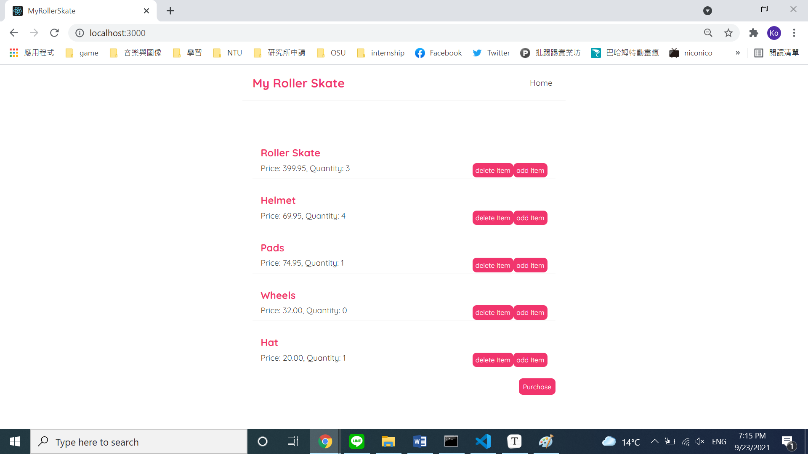
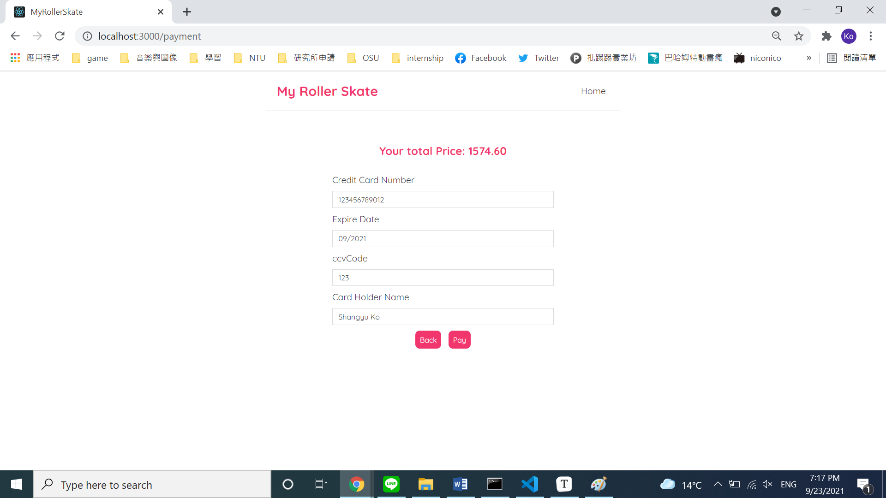
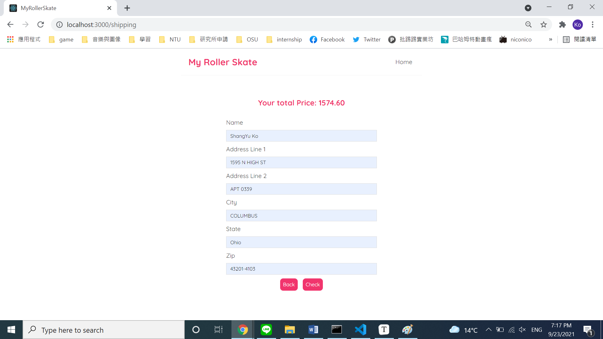
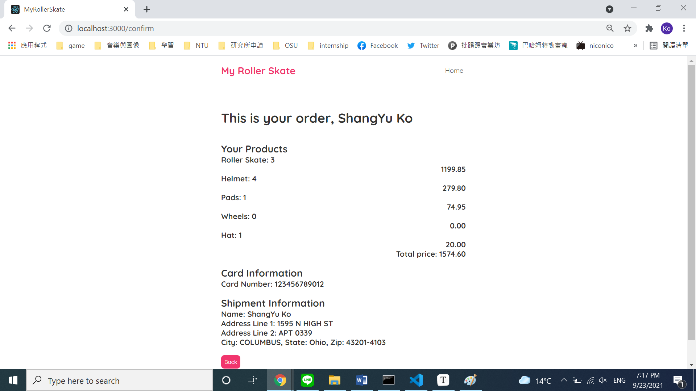

# my-roller-skate

CSE 5234 Distributed Enterprise Computing project

## Authors

| Name         | Github                                                       | name.#   |
| ------------ | ------------------------------------------------------------ | -------- |
| Shang Yu Ko  | [ShangyuKo](https://github.com/ShangyuKo)                    | ko.384   |
| Chang Yu Tai | [johnnyjana730](https://github.com/johnnyjana730) | tai.97   |
| Xiaoyi Qian  | [XiaoyiQian](https://github.com/XiaoyiQian) | qian.529 |

## Run

- Install Node.js from [official Node.js website](https://nodejs.org/en/).
- Use the first command line and run:

```bash
npx json-server --watch data/db.json --port 8000
```

- Use the second command line and run:

```bash
npm start
```

- Open the browser and go to http://localhost:3000/

## Demo

### Lab 5








